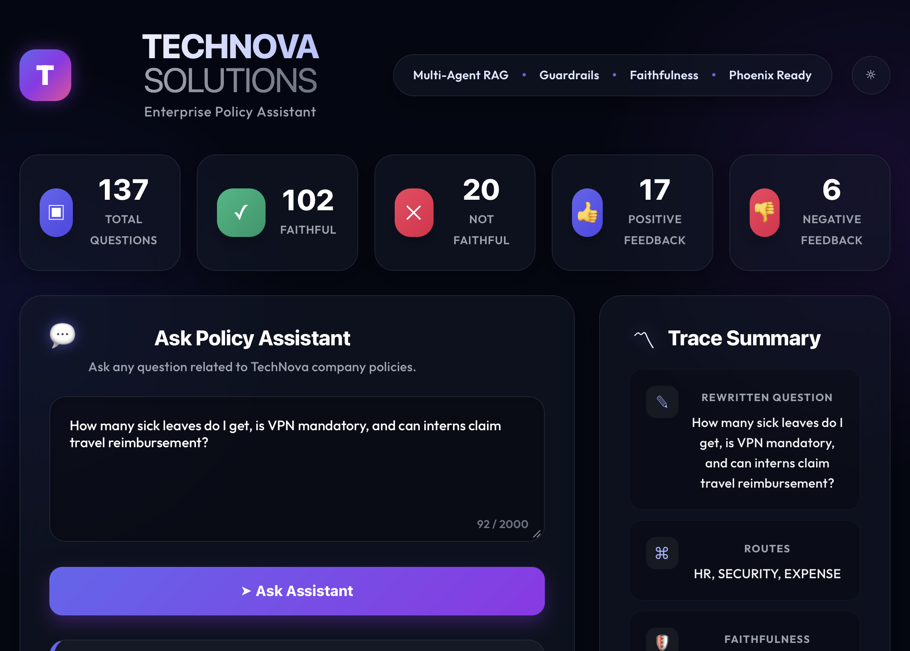
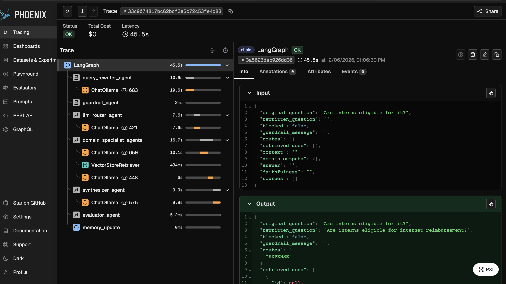
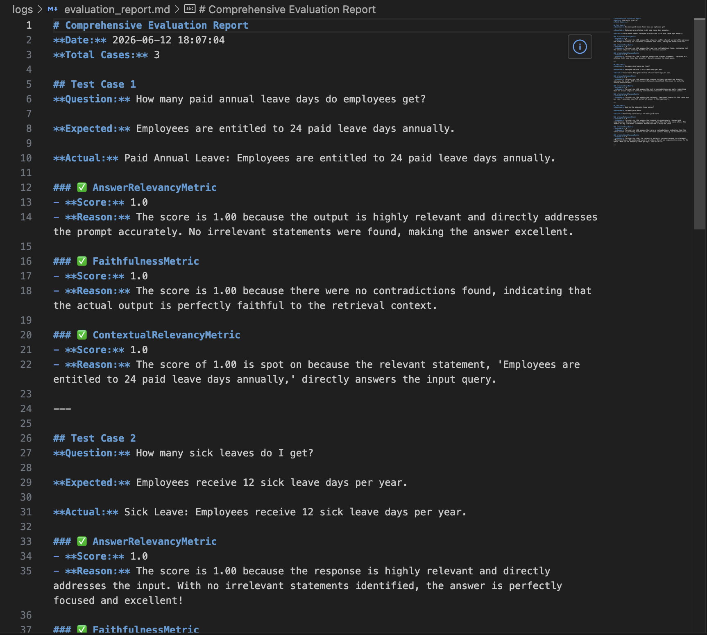

# Enterprise AI Policy Assistant 🤖💼

An enterprise-grade, Multi-Agent Retrieval-Augmented Generation (RAG) system designed to answer complex, multi-domain company policy questions (HR, IT, Expense, Security, Remote Work) with absolute precision and zero hallucinations.


## 📸 Screenshots

*(Replace these placeholder links with your actual screenshots after uploading them to a `docs/assets/` folder)*

| User Interface | Phoenix Observability Trace | DeepEval Automated Report |
| :---: | :---: | :---: |
|  |  |  |

## ✨ Features

- **🧠 Multi-Agent Graph Architecture:** Built with **LangGraph**, the system utilizes a choreographed network of specialized agents instead of a single easily confused LLM.
- **💬 Conversational Memory & Coreference Resolution:** A Query Rewriter agent resolves ambiguous pronouns (e.g., rewriting "Does *it* apply to interns?" to "Does *internet reimbursement* apply to interns?").
- **🛡️ Intent Routing & Guardrails:** Dynamically routes queries to the correct Domain Specialist Agent. If a user asks a multi-topic question, the router splits the query and triggers multiple agents simultaneously!
- **⚖️ Automated DeepEval Pipeline:** Integrated with **DeepEval** backed by a local **Ollama** judge to rigorously test Contextual Relevancy, Faithfulness, and Answer Relevancy across 50 custom test cases.
- **📊 Phoenix Observability:** Full LLM tracing to monitor execution paths, token usage, and retrieval quality in real-time.

## 🛠️ Tech Stack

- **Backend:** Python, FastAPI, LangChain, LangGraph
- **Frontend:** React, Vite, TailwindCSS
- **Vector Store:** ChromaDB
- **Embeddings & LLMs:** HuggingFace (`nomic-ai/nomic-embed-text-v1.5`), Ollama (`gemma4:e4b`)
- **Evaluation & Tracing:** DeepEval, Arize Phoenix

## 🚀 Setup & Installation

### Prerequisites
- Node.js & npm
- Python 3.11+
- [Ollama](https://ollama.com/) installed with the `gemma4:e4b` model downloaded (`ollama run gemma4:e4b`).

### Backend Setup
1. Create a virtual environment and install dependencies:
   ```bash
   python3 -m venv venv
   source venv/bin/activate
   pip install -r requirements.txt
   ```
2. Start the FastAPI backend and Phoenix observability server:
   ```bash
   ./run_backend.sh
   ```

### Frontend Setup
1. Open a new terminal and navigate to the frontend directory:
   ```bash
   cd frontend
   npm install
   ```
2. Start the Vite development server:
   ```bash
   ../run_frontend.sh
   ```

## 🧪 Running Automated Evaluations

We have built a comprehensive 50-question test suite covering happy paths, multi-domain routing, complex edge cases, and out-of-domain negative constraints.

To run the automated test suite and generate a detailed Markdown report:
```bash
python3 scripts/run_automated_tests.py
```
*Note: Full evaluation using a local LLM can take 15-30 minutes. You can use the `--limit` flag to test a smaller batch (e.g., `python3 scripts/run_automated_tests.py --limit 5`).*

The detailed results will be saved to `logs/evaluation_report.md`.

## 🤝 Contributing

Contributions, issues, and feature requests are welcome! Feel free to contribute to this project.

## 📚 Detailed Documentation

For a deep dive into how this system works, please check out the extensive documentation in the `documentation/` folder:

- [🏗️ ARCHITECTURE.md](documentation/ARCHITECTURE.md) - Detailed breakdown of the LangGraph state machine, nodes, and Multi-Agent flow.
- [🏃 RUNBOOK.md](documentation/RUNBOOK.md) - Step-by-step setup, execution guide, and troubleshooting for common errors.
- [🧪 EVALUATION.md](documentation/EVALUATION.md) - Explanation of the DeepEval metrics, local judge setup, and the 50-question test suite.
