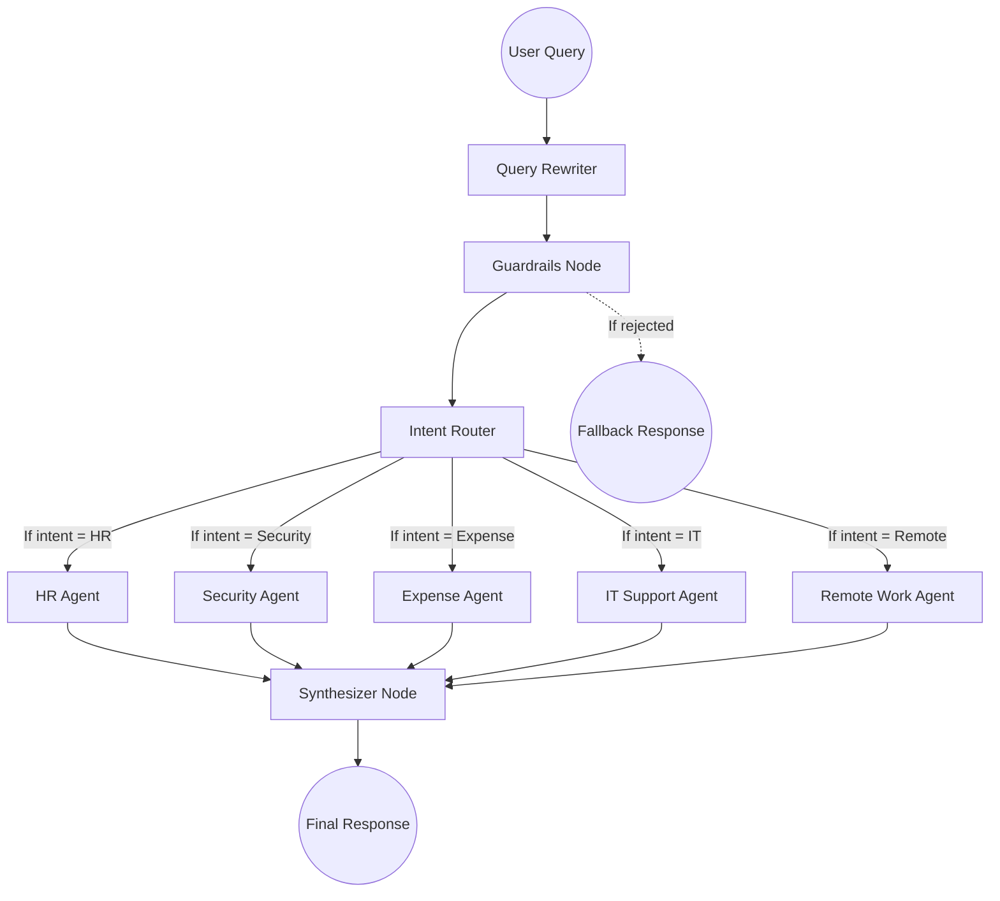

# Project Architecture 🏗️

This document outlines the architecture, flow, and component structure of the Enterprise AI Policy Assistant. 

## Project Structure

```text
ankush-AI/
├── README.md                 # Project Overview
├── ARCHITECTURE.md           # This file
├── RUNBOOK.md                # Execution and troubleshooting guide
├── EVALUATION.md             # Automated testing guide
├── agents/
│   └── multi_agent_graph.py  # Core LangGraph execution and state definitions
├── app/
│   └── api.py                # FastAPI backend serving the LangGraph application
├── data/
│   └── comprehensive_eval_questions.json # The 50-test question suite
├── docs/                     # Text files representing enterprise policies for RAG
├── evals/
│   └── faithfulness_checker.py # Deprecated evaluation logic
├── frontend/                 # React + Vite UI
├── guardrails/
│   ├── __init__.py
│   └── policy_guard.py       # Topic moderation and query blocking
├── logs/                     # Auto-generated Phoenix traces, evaluations, and interaction logs
├── observability/
│   └── phoenix_setup.py      # Arize Phoenix telemetry setup
├── scripts/
│   ├── generate_tests.py       # Procedural test generation
│   └── run_automated_tests.py  # DeepEval runner script
├── run_backend.sh            # Backend launcher script
├── run_frontend.sh           # Frontend launcher script
└── requirements.txt          # Python dependencies
```

## Data Flow & Multi-Agent Graph

The backend is entirely powered by **LangGraph**, treating the retrieval and reasoning steps as a state machine where multiple specialized agents cooperate.

When a user submits a query, it follows this exact state flow:



### 1. Query Rewriter Node (`query_rewriter_node`)
The first point of contact. This node reviews the conversational history and resolves ambiguous references. For example, if the previous turn was about *interns*, and the user asks *"Are they eligible for internet reimbursement?"*, the rewriter translates this to *"Are interns eligible for internet reimbursement?"* before continuing.

### 2. Guardrails Node (`guardrails_node`)
A safety layer. This checks the query against a strict set of rules using `policy_guard.py`. If the user asks for proprietary code, malicious advice, or off-topic chitchat, the graph immediately terminates and returns a safe fallback message.

### 3. Intent Router Node (`router_node`)
The core orchestrator. Instead of letting one LLM blindly query all documents, this LLM is strictly tasked with predicting the domains involved in the question. It returns an array of routes. 
- *Input:* "How many sick leaves do I get, and is VPN mandatory?"
- *Output:* `["HR", "SECURITY"]`

### 4. Domain Specialist Agents (`domain_agents_node`)
For every route predicted by the Router Node, a dedicated Domain Agent is triggered. These agents execute in parallel.
- Each agent only has access to the specific Vector Store representing its domain (e.g., the HR agent only searches `hr_policy.txt`).
- This completely eliminates "context dilution" where an LLM gets confused by reading an HR policy while trying to answer an IT question.

### 5. Synthesizer Node (`synthesizer_node`)
The final assembly. It gathers the discrete answers provided by the triggered Domain Agents and synthesizes them into a single, cohesive, bullet-pointed markdown response perfectly formatted for the user.
